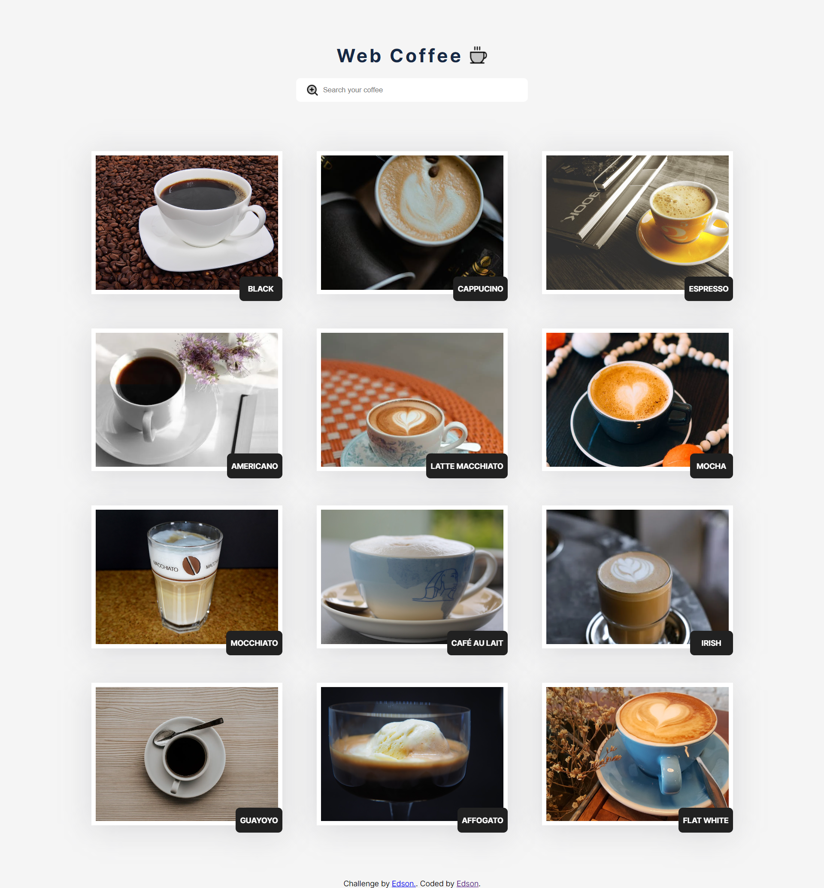

# ✨ Challange - Web coffee solution ✨

### 🧾 Sobre

Os utilizadores devem ser capazes de:

-   Ter uma visualização otimizada do site, adaptada ao tamanho da tela do seu dispositivo.
-   Controlar os estados de hover para todos os elementos interativos na página.
-   Filtrar cafés na página inicial de acordo com o seu título.
-   Ver detalhes completos sobre um café, incluindo ingredientes, foto, nome e descrição, simplesmente clicando nele na página inicial.

### Screenshot



### 🚀 Tecnologias utilizadas

-   Semantic HTML5 markup
-   CSS custom properties
-   BEM methodology
-   Flexbox
-   Desktop-first workflow

### 📖 O que eu aprendi

Durante o desenvolvimento desse projeto, aprendi a filtrar os elementos no Javascript e criar páginas dinâmicas, utilizando dados fornecidos de uma API.

```js
const exampleArray = [1, 2, 3, 4, 5];

console.log(exampleArray.forEach((value) => value * value));
// Output: (undefined)
```

### 👨‍💻 Desenvolvimento contínuo

Pretendo utilizar a metologia BEM, pois facilita a leitura do código HTML e CSS. Além disso, evita que aconteça conflitos de estilos.

### 🤝 Recursos úteis

-   [forEach 1](https://developer.mozilla.org/en-US/docs/Web/JavaScript/Reference/Global_Objects/Array/forEach) e [forEach 2](https://www.w3schools.com/jsref/jsref_foreach.asp) - Entendendo melhor o forEach
-   [BEM](https://en.bem.info/methodology/quick-start/) - Isso me ajudou a deixar o CSS fácil de ler. Gostei muito deste modelo e vou usá-lo daqui para frente.
-   [DynamicPage](https://jesielviana.gitbook.io/webdev/frontend/paginas-web-dinamicas-com-javascript) - Entendendo como funciona uma página dinâmica

### 〽️ Getting started

```zsh
    # Clonando o repositório em sua máquina
    $ git clone https://github.com/edsonjaguiar/web-coffee-main

    $ cd web-coffee-main
```
